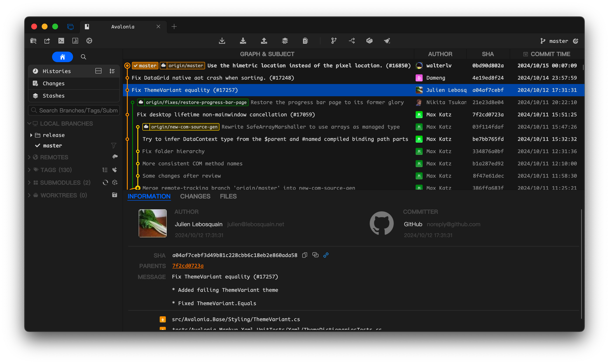
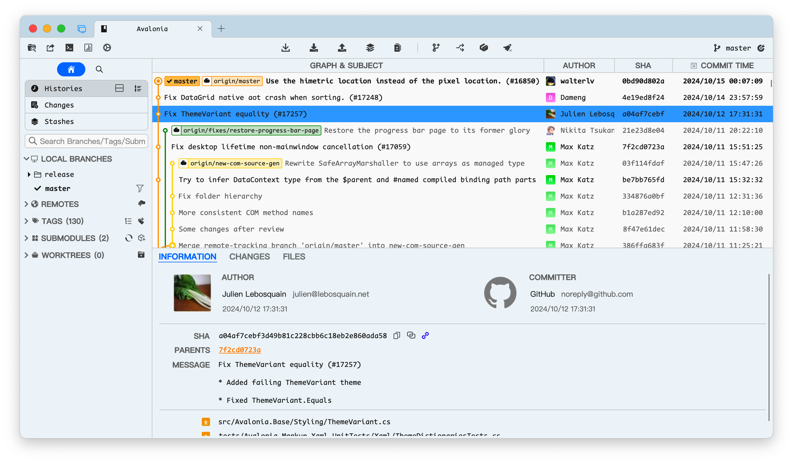

# Komorebi

[](LICENSE)
[](https://github.com/1llum1n4t1s/Komorebi/releases/latest)
[](https://github.com/1llum1n4t1s/Komorebi/releases)

C# / .NET 10 と Avalonia UI で構築されたクロスプラットフォーム対応のオープンソース Git GUI クライアントです。Git CLI をラップし、日常の Git 操作をビジュアルに行えます。

> [!NOTE]
> 本プロジェクトは [SourceGit](https://github.com/sourcegit-scm/sourcegit) のフォークです。オリジナルの開発者および全コントリビューターに感謝いたします。

## 本家 SourceGit との違い

### 初回セットアップ・ローカライズ

| 項目 | 内容 |
|------|------|
| **初回セットアップ画面** | 初回起動時に言語選択とデフォルト Clone ディレクトリを設定するウィザードを表示 |
| **OS 言語の自動検出** | OS のロケール設定を検出し、17 言語の中から最適な言語を自動選択 |
| **日本語フォント最適化** | 日本語環境では Yu Gothic UI / UDEV Gothic JPDOC をデフォルトフォントに設定 |
| **日本語バンドルフォント** | 設定画面のフォント選択に日本語 woff2 フォント（Noto Sans JP、IBM Plex Sans JP 等 8 種）を追加 |
| **3 言語の独自追加** | 本家にないタガログ語（fil_PH）・サンスクリット語（sa）・ラテン語（la）を追加し、計 17 言語に対応 |
| **全ロケール翻訳率 100%** | 本家ではロケールごとに翻訳率にばらつきがあるが、Komorebi は全 17 言語の翻訳を完全に揃えている |

### Git 操作の改善

| 項目 | 内容 |
|------|------|
| **Squash/Fixup 後の強制プッシュ** | Squash/Fixup ダイアログに「実行後に強制プッシュ（--force-with-lease）」オプションを追加 |
| **ブランチ作成後の自動プッシュ** | ブランチ作成ダイアログに「作成後にリモートへプッシュ」オプションを追加 |
| **Staged/Unstaged の配置入れ替え** | ワーキングコピー画面で Staged（上）/ Unstaged（下）の配置に変更し、ボタンアイコンの方向も直感的に修正 |
| **リポジトリ自動スキャン** | Clone ディレクトリ変更時・ワークスペース切替時にリポジトリを自動検出して追加 |

### テーマ・外観

| 項目 | 内容 |
|------|------|
| **OneDark テーマ** | Atom One Dark にインスパイアされたダークテーマを追加 |
| **White テーマ** | 純白背景のライトテーマバリアントを追加 |
| **アプリアイコン刷新** | 木漏れ日をモチーフにしたオリジナルアイコンに変更 |

### アプリケーション基盤

| 項目 | 内容 |
|------|------|
| **Velopack 自動アップデート** | Velopack による差分アップデートに対応。起動時にアップデートチェックを行い、ダウンロード進捗を表示 |
| **日本語 README** | README を全面的に日本語化 |

## スクリーンショット

| ダークテーマ | ライトテーマ |
|:---:|:---:|
|  |  |

## 動作環境

| OS | アーキテクチャ | 備考 |
|----|------------|------|
| Windows 10 以降 | x64, arm64 | |
| macOS 13.0 以降 | arm64 (Apple Silicon) | |
| Linux | x64, arm64 | Debian 12 (X11 / Wayland) で動作確認済み |

**前提条件**: Git 2.25.1 以上

## インストール

[Releases](https://github.com/1llum1n4t1s/Komorebi/releases/latest) から各プラットフォーム向けのバイナリをダウンロードできます。Velopack による自動アップデートに対応しており、起動時に新しいバージョンがあれば通知されます。

### データ保存先

| OS | パス |
|----|------|
| Windows | `%APPDATA%\Komorebi` |
| macOS | `~/Library/Application Support/Komorebi` |
| Linux | `~/.komorebi` |

> [!TIP]
> 実行ファイルと同じディレクトリに `data` フォルダを作成すると、ポータブルモードとして動作します（Windows / Linux AppImage のみ）。

### Windows

* **MSYS Git は非対応** — 公式の [Git for Windows](https://git-scm.com/download/win) をご利用ください。

### macOS

* GitHub Release から手動インストールする場合:
  ```shell
  sudo xattr -cr /Applications/Komorebi.app
  ```
* [git-credential-manager](https://github.com/git-ecosystem/git-credential-manager/releases) が必要です。
* カスタム PATH を設定する場合: `echo $PATH > ~/Library/Application\ Support/Komorebi/PATH`

### Linux

* `xdg-open`（`xdg-utils`）が必要です。
* [git-credential-manager](https://github.com/git-ecosystem/git-credential-manager/releases) または [git-credential-libsecret](https://pkgs.org/search/?q=git-credential-libsecret) が必要です。
* HiDPI 環境では `AVALONIA_SCREEN_SCALE_FACTORS` の設定が必要な場合があります。
* アクセント付き文字を入力できない場合は `AVALONIA_IM_MODULE=none` を設定してください。

---

## 機能一覧

### Git 操作

| カテゴリ | 対応操作 |
|---------|---------|
| **基本操作** | Clone / Fetch / Pull / Push / Archive |
| **ブランチ** | 作成 / リネーム / 削除（一括削除対応）/ チェックアウト / 上流設定 / 説明文編集 / フォルダ階層によるグループ表示 |
| **マージ** | Fast-forward only / No fast-forward / Squash / Don't commit / 複数ブランチの一括マージ（Octopus 戦略対応） |
| **リベース** | 通常リベース / インタラクティブリベース（Pick / Edit / Reword / Squash / Fixup / Drop） |
| **タグ** | 注釈付き・軽量タグの作成 / GPG 署名 / リモートへの Push・削除 / リスト・ツリー表示 |
| **スタッシュ** | 保存（未追跡ファイル含む・ステージ済みのみ）/ Apply / Pop / Drop / Clear |
| **リセット** | Soft / Mixed / Merge / Keep / Hard |
| **その他** | Cherry-pick / Revert / Reword / Amend / Bisect（GUI サポート）/ Reflog |
| **ワークツリー** | 作成 / 削除 / Prune / サイドバーにグループ表示 |
| **サブモジュール** | 追加 / 削除 / 移動 / Init / Deinit / Update / ブランチ設定 / ツリー・フラット表示 |
| **GitFlow** | Feature / Release / Hotfix の開始・完了 / Squash / Push / ブランチ保持オプション |
| **Git LFS** | Track / Fetch / Pull / Push / Prune / ロック管理（一括解除対応） |

### コミット

* **Sign-off** / **No-verify** オプション
* **GPG / SSH / X.509 署名**（リポジトリ単位で設定可能）
* **コミットメッセージ履歴**（リポジトリごとに直近 10 件を保存）
* **コミットテンプレート** — 変数展開対応（`${branch_name}`, `${files}`, `${files_num}` など、正規表現による変換もサポート）
* **Conventional Commit ヘルパー** — 12 種類のデフォルトタイプ（feat / fix / wip / revert / refactor / perf / build / ci / docs / style / test / chore）、リポジトリごとに JSON でカスタマイズ可能

### 差分表示

| 種別 | 機能 |
|------|------|
| **テキスト差分** | インライン（Unified）/ サイドバイサイド / 全文表示 / 空白無視 / ワードラップ / 非表示文字の表示 / TextMate 文法によるシンタックスハイライト / 文字レベルのハイライト |
| **画像差分** | 左右並列 / オーバーレイ / スワイプ / スケール比較。PNG / JPG / GIF / BMP / ICO / WebP / TGA / DDS / TIFF 対応 |
| **バイナリ差分** | 新旧サイズ表示 |
| **サブモジュール差分** | コミット範囲の表示 |
| **パッチ** | 保存 / 適用（空白処理モード: No Warn / Warn / Error / Error All） |

### 履歴・グラフ

* **ビジュアルコミットグラフ** — 10 色のカラーパレット（カスタマイズ可能）、ベジェ曲線で描画、未マージコミットの透過表示
* **表示オプション** — 日付順・トポロジカル順 / 著者・SHA・日時カラムの表示切替 / 1 カラム・2 カラムレイアウト / 相対時間表示 / タグ表示 / First-parent-only モード
* **フィルタリング** — ローカルブランチ・リモートブランチ・タグによる Include / Exclude フィルタ
* **コミット検索** — SHA / 著者 / コミッター / メッセージ / パス / 内容で検索
* **ブックマーク** — 7 色でコミットやブランチにマーク可能
* **署名検証** — 署名のステータスを色分け表示（有効: 緑 / 期限切れ: オレンジ / 不正: 赤）
* **コミットリンク** — GitHub / GitLab / Gitee / Bitbucket / Codeberg / Gitea / sourcehut / GitCode への自動リンク生成

### AI コミットメッセージ生成

OpenAI または OpenAI 互換 API（Azure OpenAI 含む）を利用してコミットメッセージを自動生成できます。

* **2 段階生成** — ファイルごとの差分分析 → 最終メッセージ生成
* **プロンプトのカスタマイズ** — 分析プロンプト・生成プロンプトをそれぞれ変更可能
* **複数 AI サービスの登録** — グローバル設定で複数サービスを管理、リポジトリごとに使い分け
* **環境変数からの API キー取得** に対応
* **ストリーミング応答** / **Chain-of-thought タグの自動除去**

### Issue トラッカー連携

コミットメッセージ内の正規表現パターンにマッチする文字列を Issue リンクに変換します。URL テンプレートにキャプチャグループ（`$1`, `$2` 等）を埋め込み可能。リポジトリごとに複数のトラッカーを設定できます。

### カスタムアクション

リポジトリ / コミット / ブランチ / タグ / リモート / ファイルのスコープごとに独自のアクションを定義し、コンテキストメニューから実行できます。コントロール種別: テキストボックス / パスセレクタ / チェックボックス / コンボボックス。

### ワークスペース

名前付きワークスペースに複数のリポジトリをグループ化して管理できます。色分け・デフォルト Clone ディレクトリの設定・起動時の復元に対応しています。

### 統計

LiveChartsCore による貢献統計グラフを表示します。全期間（月次）/ 今月（日次）/ 今週（日次）の 3 つのビューで、著者ごとのフィルタリングが可能です。

---

## 外部ツール連携

### コードエディタ

VS Code / VS Code Insiders / VSCodium / Cursor / Sublime Text / Zed / Visual Studio（Windows のみ）に加え、JetBrains Toolbox 経由で CLion / GoLand / Rider / WebStorm / PyCharm / RustRover 等を自動検出します。`external_editors.json` でカスタムパス指定や除外設定も可能です。

### マージ・差分ツール

| ツール | Windows | macOS | Linux |
|-------|:-------:|:-----:|:-----:|
| VS Code / VS Code Insiders | ✔ | ✔ | ✔ |
| KDiff3 | ✔ | ✔ | ✔ |
| Beyond Compare | ✔ | ✔ | ✔ |
| P4Merge | ✔ | ✔ | ✔ |
| Meld | ✔ | — | ✔ |
| VSCodium / Cursor | ✔ | ✔ | ✔ |
| TortoiseMerge / WinMerge | ✔ | — | — |
| Visual Studio / Plastic SCM | ✔ | — | — |
| Xcode FileMerge | — | ✔ | — |

### ターミナル

| OS | 対応ターミナル |
|----|-------------|
| Windows | Git Bash / PowerShell / CMD / Windows Terminal |
| macOS | Terminal.app / iTerm2 / Warp / Ghostty / kitty |
| Linux | GNOME Terminal / Konsole / XFCE4 Terminal / LXTerminal / Deepin Terminal / MATE Terminal / Foot / WezTerm / Ptyxis / Ghostty / kitty / Custom |

---

## カスタマイズ

### テーマ

ライト / ダーク / **White** / **OneDark** / システム連動の 5 モード。JSON ファイルによるテーマオーバーライドで、基本カラー・グラフカラーパレット・グラフ線の太さ・未マージコミットの透明度を細かく調整できます。

### フォント・表示

* デフォルトフォント / 等幅フォントの個別設定
* フォントサイズ / エディタのタブ幅
* UI ズームレベル
* スクロールバーの自動非表示

### リポジトリ設定

リポジトリごとにユーザー名・メール / デフォルトリモート / マージモード / GPG 署名 / HTTP プロキシ / 自動 Fetch（間隔設定可能）/ サブモジュール自動更新の確認 / コミットテンプレート / Issue トラッカー / AI サービス / カスタムアクション / Conventional Commit タイプ を個別に設定できます。

---

## 多言語対応

17 言語をサポートしています（全言語翻訳率 100%）:

Deutsch · English · Español · Filipino (Tagalog) · Français · Bahasa Indonesia · Italiano · 日本語 · 한국어 · Latina · Português (Brasil) · Русский · संस्कृतम् · தமிழ் · Українська · 简体中文 · 繁體中文

---

## コマンドライン

```
komorebi <DIR>                       # リポジトリを開く
komorebi --file-history <FILE_PATH>  # ファイル履歴を表示
komorebi --blame <FILE_PATH>         # Blame を表示（HEAD）
```

---

## ライセンス

[MIT License](LICENSE)

サードパーティライセンスの詳細は [THIRD-PARTY-LICENSES.md](docs/THIRD-PARTY-LICENSES.md) を参照してください。
